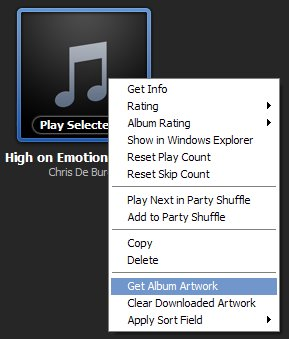
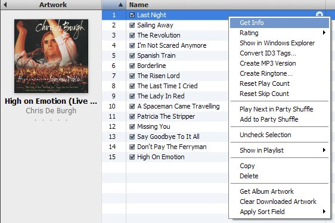
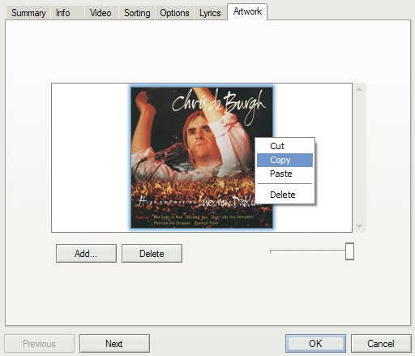

{} This blog post has been imported from my old Blogger
blog. It is more than 10 years old and likely horribly out of date. I have not
updated the content nor fixed any broken links. {}

This is the continuation of a short [series of blog postings]() about how I tag my MP3 files. Today I'll share my
experience in displaying cover art in various media players.

I am using two portable players: An [Android phone](http://www.android.com/) and
an [iPhone](http://www.apple.com/iphone). On my laptop I usually use
[iTunes](http://www.apple.com/itunes), but sometimes I fall back to [Windows
Media Player](http://www.microsoft.com/windows/windowsmedia/player/11) because
of its fast startup time. I keep MP3 files in individual folders per album, so I
also want the thumbnail view of Windows explorer to show the cover art.

Let's start with a short summary of what works for me: Embed cover images into
the first track of every album, and additionally save them as `Folder.jpg` files
in the album directories. See below for the long story.

## Analysis of different players

There are various ways of attaching cover art to MP3 files, and every player
that I use seems to do it slightly differently. Here is what I found out:

- **iTunes** stores cover images in its own proprietary storage in some ITC2
  format that I don't know anything about
  (`My Documents\\My Music\\iTunes\\Album Artwork\\Download\\6118F104927B998E\\10\\10\\05\\6118F104927B998E-6DBB7171FCCCC5AA.itc2`).
  Fortunately, it also shows images that are included in the MP3 files.
- The **iPhone** seems to display whatever iTunes displays.
- **Android** also works fine with cover images embedded into the MP3 files.
- **Windows Explorer** expects cover art in `Folder.jpg` files. It does not show
  embedded images.
- **Windows Media Player** seems to keep cover art in a whole bunch of different
  hidden files like `Folder.jpg`, `AlbumArtSmall.jpg`,
  `AlbumArt\_{SOME\_GUID}\_Large.jpg`, etc. It does read covers from the MP3 files
  however. If you import a MP3 file into the Windows Media Player library it
  automatically generates all files. This includes Folder.jpg, which is needed
  for Windows Explorer

In summary, all of my players show images that are embedded in MP3 files. It
seems to be enough to embed a cover image into the first track of an album.
Windows Explorer needs Folder.jpg, which is easiest to create by importing files
into Windows Media Player.

Caveat: Windows Media Player resizes `Folder.jpg` files to 200x200 pixels without
asking, so don't use this file as your primary storage. I want my covers to be
600x600 pixels, which seems to be a good compromise between file size and high
quality (e. g. for iTunes cover flow). Because of that I have an additional
`Cover.jpg` file in all of my album directories. This is not needed for any
player, but I like to have it there for scripts that I use, e. g. to generate
listings of my files.

## Getting and embedding cover images with iTunes

Before you can embed cover art into an MP3 file you need to have it. Of course
you can scan them yourself, but I find it much easier to use iTunes, which has
many album covers in a very high quality.

Here is what you need to do: Import the album MP3s into the iTunes library and
choose "Get Album Artwork" in the album context menu:

Sometimes iTunes does not have a matching cover - then you are back to scanning
yourself. But more often than not you get a cover image. As mentioned above,
iTunes stores it in its own proprietary format, but fortunately it is quite easy
to extract. Open the album and right-click the first track, and then "Get Info":

In the dialog that opens go to the "Artwork" tab, select the image and copy it
with Ctrl-C or using the context menu. Then immediately paste it back using the
context menu or Ctrl-V. Click OK and iTunes saves the image directly into the
MP3 file.

It is worth mentioning, that you can of course also paste the copied image into
your favorite graphics editor, or straight into an Explorer window. The latter
creates a file `image 1.bmp`, which you can then convert into a JPEG, e.g., to
use it as `Folder.jpg`

If you don't want to create Folder.jpg yourself, simply import the folder with
your MP3 files (and with the embedded cover) into the Windows Media Player
library. It will then generate `Folder.jpg` for you.
