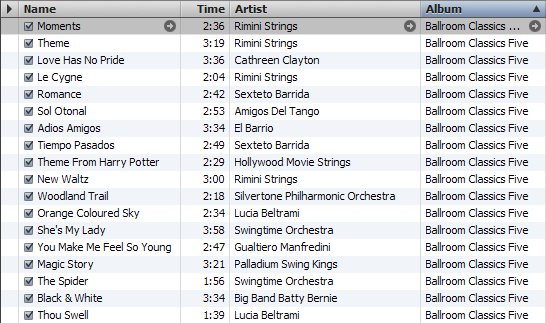
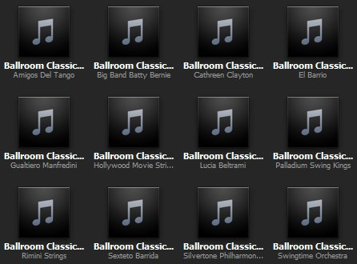
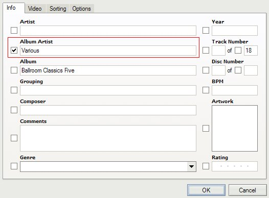
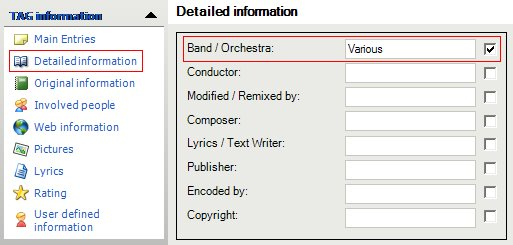

{} This blog post has been imported from my old Blogger
blog. It is more than 10 years old and likely horribly out of date. I have not
updated the content nor fixed any broken links. {}

Being a proud owner of a brand-new [Android](http://www.android.com/) phone and
having a couple of weeks of vacation over the holidays, I decided that this is
the perfect time to reorganize my digital music collection and to rip the last
few CDs for which I had not had the time before.

I had to go through some trial-and-error experiments to find a tagging scheme
that works for me, so I figured that my results might be interesting for others
as well. I'm going to try to make a mini-series of blog postings that explain
how I tag my MP3 files. I do not claim that this is the one and only tagging
scheme, but it works well for me. If you use a different tagging scheme that
works better for you, please let me know.

## Tagging across devices, players, and media types

Being me, I want my music to be tagged perfectly for the handful of devices and
programs that I use. This includes my [iPhone](http://www.apple.com/iphone/)
that I recently used mostly as a media player and now also my Android phone. On
Windows my main audio player is [iTunes](http://www.apple.com/itunes/), but
sporadically I also use [Windows Media
Player](http://www.microsoft.com/windows/windowsmedia/de/player/11/default.aspx),
mainly because it starts up much faster. Finally, I want to use the capability
of the Windows Explorer to show the track titles when viewing tracks in the file
system.

Tagging MP3s perfectly across these players was more challenging than I
anticipated. It is very important to use the right [ID3
tags](http://www.id3.org/), and until recently, I wasn't even aware of some of
them. Here is my list of features of a "perfect" tagging scheme:

1. Files from the same disc (set) should be be recognized as such. If not tagged
   correctly, iTunes (and other players) show tracks from the same CD as
   belonging to multiple CDs. This happens mostly for compilations. See below
   for the solution.
2. Files and folders should show cover art in high quality. I want to see my
   cover art when playing a song, when using iPhone/iTunes cover flow, and as
   thumbnails in Windows Explorer.
3. The files should play in the correct order. This seems trivial, but
   unfortunately it isn't.

Getting the tagging right is not made easier by the quite diverse collection of
media types in my collection. I have albums of one artist, compilations from
multiple artists, audio books, ballroom dance music, comedy discs, movie sound
tracks, musicals, and so on. I also have a number of single MP3 files of an old
collection of chart samplers that I didn't want to keep in their entirety.

## Getting compilations recognized as single discs

For today, I thought, I'd get started with how to get single discs recognized as
single discs. Here is a ballroom dancing album that contains tracks from various
artists:

Clearly, every track is labeled with the same album name, so one might expect
that iTunes recognizes the tracks as belonging to the same album. Unfortunately,
this is not the case. Here is the result:

iTunes only recognized files as belonging to the same album if they also are
from the same artist. Fortunately, there is a simple way to make iTunes
understand that this is indeed only one album. Just select all tracks, right
click, and select "Get Info" in the context menu. Then edit the "Album Artist"
tag to have the same value for all tracks. I usually choose "Various", sometimes
"Soundtrack" or similar. The album artist field is also useful for albums of a
single artist "Somebody" where individual tracks are from "Somebody feat.
Somebody Else".

I usually do not edit ID3 tags in iTunes. There are quite some decent ID3
editors out there. My favorite one is [ID3-TagIT](http://www.id3-tagit.de/).
Unfortunately it is not developed any more, but it is still available for
download from several download archives. Here is how I enter the same
information in the "Detailed Information" editor:

Technically, the "Album Artist" information is stored in the 'TPE2' ID3 frame
that is [defined](http://www.id3.org/id3v2.4.0-frames) as follows: “The
'Band/Orchestra/Accompaniment' frame is used for additional information about
the performers in the recording.” Arguably, this definition does not quite match
what we use it for, but all players seem to use it as the "album artist" as
intended.

Let me know if this explanation was helpful for you. Check back later for other
topics I'd like to write about in future postings: Which ID3 version(s) to use,
how to [include cover art](), how to handle
sets of two or more discs, audio books, and what else comes to my mind until
then. Let's hope that I find the time.
